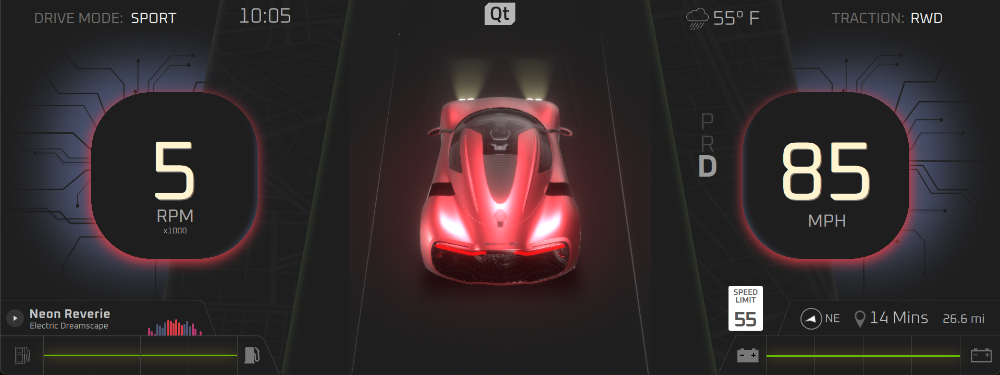
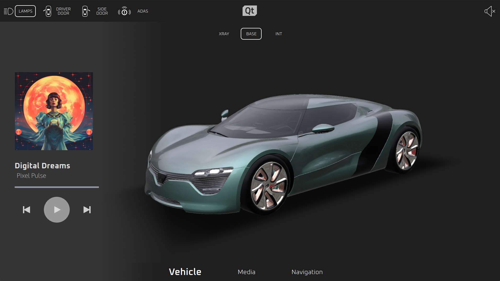

# Project Antares


## Description
Musically inspired, project Antares demonstrates the latest technologies from Qt, combining photorealistic realtime 3D with 2D shader effects imported directly from Figma. The project includes both a cluster (GLO) and an IVI (QtMediaSwipe) interface that communicate with each other.

## Visuals




## Vehicle Control WebSocket API Documentation

### Connection Details

- **Host**: `websocketHost` in App.qml (127.0.0.1 by default)
- **Port**: `websocketPort` in App.qml (8080 by default)
- **Protocol**: WebSocket (ws:// or wss://)

### Overview

This WebSocket API allows clients to control various aspects of a vehicle's dashboard and systems. Communication is done through text messages in a simple `command:value` format.

### Message Format
Messages should be sent as strings in the following format:
```
command:value
```
- `command` is the property to modify
- `value` is the new value for the property

### Notes

- Boolean values must be specified as string literals: `"true"` or `"false"`
- Numeric values should be sent as strings that can be parsed as numbers
- The server logs received messages for debugging purposes
- Invalid commands will be logged with a "Warning: message went unhandled" message

### Available Commands

| Command | Value Type | Description | Possible Values |
|---------|------------|-------------|----------------|
| `theme` | String | Sets the theme/appearance | Any valid theme state |
| `doorLeft` | Boolean | Controls the driver's door status | `"true"` (open), `"false"` (closed) |
| `doorRight` | Boolean | Controls the passenger's door status | `"true"` (open), `"false"` (closed) |
| `turnSignalLeft` | Boolean | Controls the left turn signal | `"true"` (on), `"false"` (off) |
| `turnSignalRight` | Boolean | Controls the right turn signal | `"true"` (on), `"false"` (off) |
| `qsrIcons` | Boolean | Controls QSR icons display | `"true"` (show), `"false"` (hide) |
| `gear` | Boolean | Controls gear status | `"true"`, `"false"` |
| `lamps` | Boolean | Controls vehicle lights | `"true"` (on), `"false"` (off) |
| `adasEnabled` | Boolean | Controls drive mode | `"true"` (ADAS mode), `"false"` (SPORT mode) |
| `speed` | Number | Sets the vehicle speed | Any valid number |
| `fuel` | Number | Sets the fuel level | Any valid number (likely a percentage) |
| `battery` | Number | Sets the battery level | Any valid number (likely a percentage) |
| `adasRot` | Number | Sets the ADAS rotation value | Any valid number |
| `units` | String | Sets the measurement units | Valid unit identifier string |

### Example Messages
```
theme:dark
doorLeft:true
doorRight:false
speed:65
fuel:75
battery:80
adasEnabled:true
turnSignalLeft:true
```
## Project Structure
The project is organized into three main directories:

* **common/** - Shared code for vehicle data model and CAN interface
* **Cluster/** - Digital instrument cluster with QML-based UI showcasing Qt Safe Renderer integration
* **IVI/** - In-Vehicle Infotainment system featuring media player, navigation and 3D car view

Both applications (Cluster and IVI) link against the common library, allowing them to share a single source of truth for vehicle data. They can be built and run independently or together.

## Installation
In order to successfully run this demo, the following is required:

* Installation of Qt 6.8.3
* Installation of Qt Creator
* Installation of Qt Design Studio
* Build/Install Qt Designer Components 
```
git clone https://code.qt.io/qt-labs/qtquickdesigner-components.git
mkdir buildDScomponents
cd buildDScomponents
cmake -GNinja -DCMAKE_INSTALL_PREFIX=<path_to_qt_install_directory> <path_to_qtquickdesigner-components>
cmake --buildDScomponents .
cmake --install .
```
* Build/Install Qt Safe Renderer (source code requires Qt Device Creation Enterprise license)
```
git clone "https://codereview.qt-project.org/tqtc-boot2qt/qtsaferenderer-runtime"
mkdir buildQsrRuntime
cd buildQsrRuntime
cmake -GNinja -DCMAKE_INSTALL_PREFIX=<path_to_qt_install_directory> <path_to_qtsaferenderer-runtime>
cmake --buildQsrRuntime .
cmake --install .
```
```
git clone "https://codereview.qt-project.org/tqtc-boot2qt/qtsaferenderer"
mkdir buildQsr
cd buildQsr
cmake -GNinja -DCMAKE_INSTALL_PREFIX=<path_to_qt_install_directory> <path_to_qtsaferenderer
cmake --buildQsr .
cmake --install .
```
## Building and Running the Application

The easiest path is to download and install a 6.8.3 Qt Creator kit for your host environment (e.g. macOS/Windows).  This will enable you to easily build and deploy to whatever target you prefer (e.g. QNX or Android).

#### Building Manually with CMake
If you prefer to build projects manually, you can do so:

#### Building the Cluster application
```bash
cd Cluster
mkdir build && cd build
cmake ..
cmake --build .
```

Run the application:
```bash
./GLOApp
```

#### Building the IVI application
```bash
cd IVI
mkdir build && cd build
cmake ..
cmake --build .
```

Run the application:
```bash
./QtMediaSwipeApp
```

> **Note**: During the build process, you may see warnings about "spirv-opt" or missing Vulkan components. These can be safely ignored as they are related to shader compilation that's not critical for the basic functionality.

### Using Qt Creator or Qt Design Studio
To open in Qt Creator or Qt Design Studio:

1. Open each project:
   - For the cluster interface: Open `Cluster/GLO.qmlproject`
   - For the IVI interface: Open `IVI/QtMediaSwipe.qmlproject`

2. Build and run each project separately

3. The applications will automatically connect via the WebSocket API

## Automated Build Process

This project uses an automated CI/CD pipeline powered by GitHub Actions, AWS CodeBuild and Anthropic's Claude Code:

### When Code is Pushed
1. **GitHub Actions** automatically triggers a Boot2Qt build on AWS CodeBuild
2. **AWS CodeBuild** cross-compiles the application for ARM64 AWS EC2 instances  
3. **Automated Packaging** creates deployment artifacts and GitHub releases

### When Builds Fail
The system includes **AI-powered failure analysis**:
1. **Claude Code AI** automatically analyzes build failures and error logs
2. **Intelligent Fixes** - Creates fix branches with code corrections when possible
3. **Auto-PR Creation** - Generates pull requests with fixes for review
4. **Fallback Issues** - Creates detailed issue reports when fixes aren't possible

This dramatically reduces time from build failure to resolution, often providing working fixes within minutes of a failure.

## Testing
The project includes Squish test suites located in `Cluster/tests/` for automated UI testing.
`suite_antares-basic` contains tests developed more in line with a linear scripting, 'record-and-playback' style of test scripts.
`suite_antares-framework` contains tests developed with a Page Object Model style of automation architecture, regarding separating the object references and interactions between the Cluster and IVI AUTs.

When testing with multiple applications (IVI & Cluster), as is done in `suite_antares-framework/tst_media-parity`, use application context switching to switch Squish's focus between IVI and ClusterApp, respectively. e.g.:
`setApplicationContext(applicationContext('IVIApp'))`
`setApplicationContext(applicationContext('ClusterApp'))`

When using the framework approach that has been developed in `suite_antares-framework`, start each test with the following lines:
```
source(findFile('scripts', 'antares-setup.py'))

def main():     
    Setup( {'IVIApp': 'launch', 'ClusterApp': 'launch'} )
``` 

The `Setup()` function comes from the `antares-setup.py` file. It imports all additional framework and convenience/helper files. 
As shown in the example above, you can specify if you want to "launch" or "attach" either of the Antares GUI applications in a given test.

## Authors and acknowledgment
Design/Visuals: Shawn Dorsey

Development/Coding/Pipeline: Taylor Fouts

Squish QA: Aaron LaBomascus

