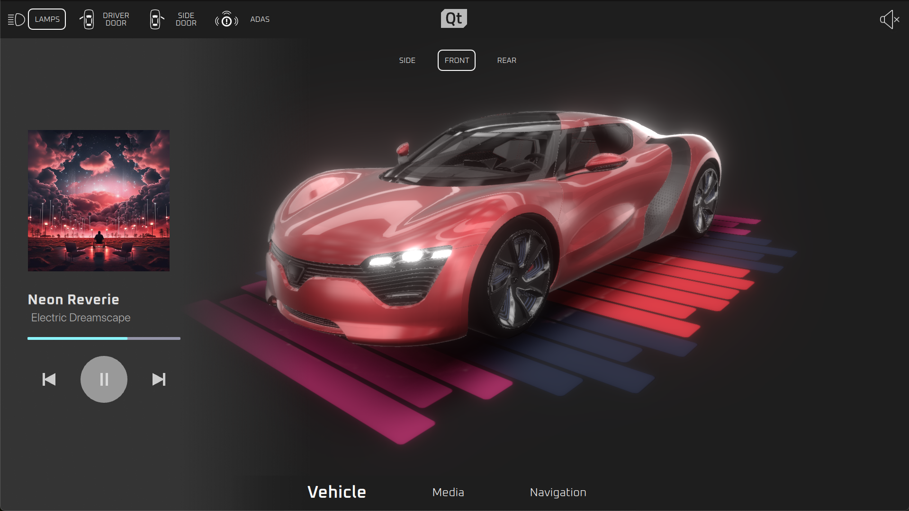

# Project Antares


## Description
Musically inspired, project Antares demonstrates the latest technologies from Qt, combining photorealistic realtime 3D with 2D shader effects imported directly from Figma

## Visuals




This project was demoed on Panasonic's virtual SkipGen platform, an AWS Graviton based Android Automotive OS:


## Installation
In order to successfully run this demo, the following is required:

* Installation of Qt 6.7.X or later
* Installation of Qt Creator
* Installation of Qt Design Studio
* Build/Install Qt Designer Components 
```
git clone https://code.qt.io/qt-labs/qtquickdesigner-components.git
mkdir buildDScomponents
cd buildDScomponents
cmake -GNinja -DCMAKE_INSTALL_PREFIX=<path_to_qt_install_directory> <path_to_qtquickdesigner-components>
cmake --buildDScomponents .
cmake --install .
```
* Build/Install Qt Safe Renderer (source code requires DCE license)
```
git clone "https://codereview.qt-project.org/tqtc-boot2qt/qtsaferenderer-runtime"
mkdir buildQsrRuntime
cd buildQsrRuntime
cmake -GNinja -DCMAKE_INSTALL_PREFIX=<path_to_qt_install_directory> <path_to_qtsaferenderer-runtime>
cmake --buildQsrRuntime .
cmake --install .
```
```
git clone "https://codereview.qt-project.org/tqtc-boot2qt/qtsaferenderer"
mkdir buildQsr
cd buildQsr
cmake -GNinja -DCMAKE_INSTALL_PREFIX=<path_to_qt_install_directory> <path_to_qtsaferenderer
cmake --buildQsr .
cmake --install .
```
## Authors and acknowledgment
Design/Visuals: Shawn Dorsey

Development/Coding: Taylor Fouts

## License
In order to build this project a Qt Device Creation License is required.
